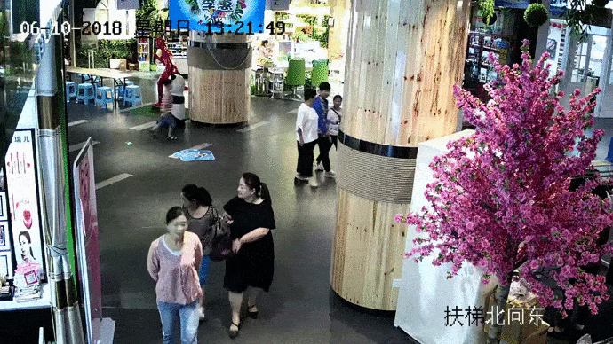
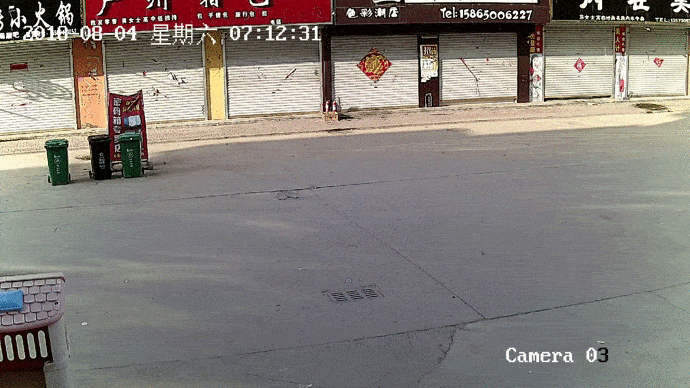

Deep Learning Project

Tracking people in CCTV using YOLO
==================================

I. Introduction
----------------
현대사회에서 CCTV는 보안 및 치안 등의 목적으로 곳곳에 설치되어 있다. 사람들의 편리와 안전을 지켜주기 위해 하루에도 엄청난 양의 데이터를 쏟아내고 있지만, 미아가 생기고 범죄 사건이 발생한다. 본 프로젝트에서는, YOLO를 활용한 Object Tracking으로 미아 혹은 수상한 사람을 CCTV에서 검출하여 다른 각도의 CCTV에서 또한 발견한 인물을 검출하도록 노력하였다. YOLO의 여러 버전들을 비교 분석하며, 목표 인물이 영상에 검출 되었다면 실제 사람이 해당 영상을 통해 확인하고 추적하는 컨셉이기 때문에 끊기지 않는 추적보다는 목표 인물 검출에 포커스를 두었다.
   
#### 데이터셋 소개: 실내 50개, 실외 50 총 100개의 폴더로 구성
<p align="center"></p>

* 폴더 구성
  * video : 추적대상이 찍힌 영상 파일(각 폴더마다 3~5개의 
  * json : json형식의 bounding box 좌표
  * frames : 추적대상의 이미지 파일

#### Prerequisites (yolov5)
```
$ git clone https://github.com/ultralytics/yolov5  # clone repo
$ cd yolov5
$ pip install -r requirements.txt  # install dependencies
```
 
II. Result
-----------
#### YOLOv3, YOLOv4 + DeepSORT, YOLOv5 비교
<p align="center">  </p>

#### Best weight: epoch별로 precision, recall, 0.5mAP, .5:.95mAP으로 weight가 산출 되는데, default 값으로 설정하여 .5mAP 10%, .5:.95mAP 90% 비중을 주어 가장 장 나온 가중치를 이용하여 테스트 영상에서 인물을 검출 하였음


- 실내 17개의 frame 학습 후 test (핑크 자켓 여성)
- 실외 18개의 frame 학습 후 test (분홍티 여자아이)
<p align="center"> </p>

- 실내 9개의 frame 학습 후 test (빨간 줄무늬 남자아이)
- 실외 16개의 frame 학습 후 test (중절모 남성)
<p align="center"> </p>

III. Process
-------------
<p align="center"></p>

1. Preprocess
   * Image Augmentation : [Code](기중 이미지 증강 시키는 코드 커밋하고 여기에 코드 url 넣어주세여)
      <p align="left"></p>
         
   * json -> txt : [Code](https://github.com/yeji0701/DeepLearning_Project/blob/main/code/jc/00_label_json_to_txt.ipynb)
      <p align="center"></p>
       
2. Train
   * Changing Resolution Size
   ```
   # 정확도 향상을 위해 yolo.cfg의 픽셀 해상도를 크게 함

   batch=64
   subdivisions=32
   width=608  <-- 변경
   height=608  <-- 변경
   ```
   * Optimizing Anchor Box : [Code](https://github.com/yeji0701/DeepLearning_Project/blob/main/code/jc/01_yolov5x_with_autoanchor.ipynb)
   ```
   from utils.autoanchor import *
   _ = kmean_anchors(path='./data.yaml', n=9, img_size=640, thr=4.0, gen=1000, verbose=True)
   ```
   
3. Test
   * Detect Single Object
   ```
    # confidence가 높은 1개의 타겟만 검출하도록 general.py 소스 코드 변경
   
    # Settings
    min_wh, max_wh = 2, 4096  # (pixels) minimum and maximum box width and height
    max_det = 1  # maximum number of detections per image
    max_nms = 30000  # maximum number of boxes into torchvision.ops.nms()
    time_limit = 10.0  # seconds to quit after
    redundant = True  # require redundant detections
    multi_label = nc > 1  # multiple labels per box (adds 0.5ms/img)
    merge = False  # use merge-NMS
   ```
   * Adjusting Confidence Threshold
   ```
   # -thresh {} <-- 조정하여 되도록 target만 detection하도록 함
   
   ./darknet detector demo custom_data/detector.data custom_data/cfg/yolov3-custom-test.cfg 
   backup/yolov3-custom_best.weights ./test.mp4 - thresh 0.6 -out_filename out.avi -dont_show
   ```
   
4. Evaluation
   * mAP (Mean Average Precision)은 Object Detection의 평가지표로 많이 사용되지만 끊김 없이 특정 물체를 따라기기보다 특정 인물을 검출하는 것이 목표인 본 프로젝트에서는 해당 지표를 이용하여 성능을 평가하기에는 한계가 존재:
      - mAP 값이 높아도 물체를 잘 tracking 하는 것은 아니라 다른 물체를 잡거나 중복 감지를 해도 값이 높아지는 것을 발견했음
   * 그렇기 때문에 자체 수기 산출 방식을 고안하였고, 초당 3 프레임 간격으로 프레임을 샘플링하여 수기로 Accuracy, Precision, Recall, F1-score을 산출 하였음
   * [Detailed scoreboard](https://github.com/yeji0701/DeepLearning_Project/blob/main/scoreboard.xlsx)
      <p align="left"></p>

마치며
------
- 배운점
1. 다양한 이미지 증강 기법  
2. Object detection 알고리즘의 발전  
3. YOLO 모델의 원리 학습  
4. IoU, mAP 등 Object detection 평가 지표에 대한 이해

- 개선할 점
1. yolo 소스 코드 분석을 통한 데이터에 최적화 된 튜닝
2. 보다 Target에 특화된 Custom Training을 통한 모델 개선
3. 모든 시도는 소중하니, 결과를 기록하는 습관 개선

Built with:
-----------
- 김미정
- 김예지
   * 이미지 증강 및 mixup, YOLOv3-tiny와 YOLOv3를 이용한 object tracking
   * Github: https://github.com/yeji0701
- 이기중
- 최재철
   * yolov3-tiny
   * yolov5 config setting, scoreboard sheet
   * Github: https://github.com/kkobooc

Acknowledgements:
-----------------
- [Darknet](https://github.com/pjreddie/darknet)
- [Alexey](https://github.com/AlexeyAB)
- [YOLOv4](https://github.com/kiyoshiiriemon/yolov4_darknet)
- [YOLOv4 + DeepSORT](https://github.com/theAIGuysCode/yolov4-deepsort)
- [YOLOv5](https://github.com/ultralytics/yolov5)

